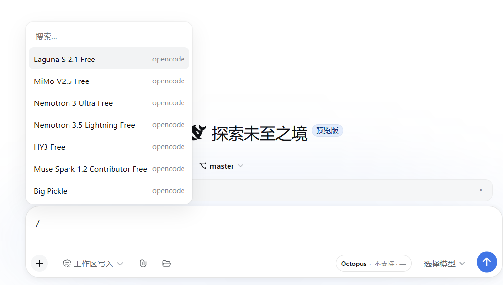
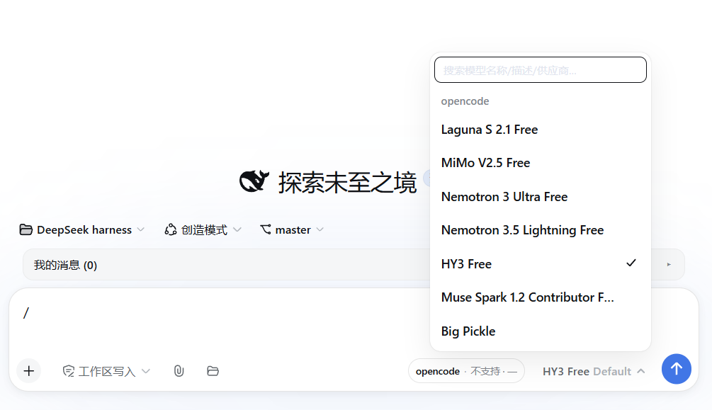
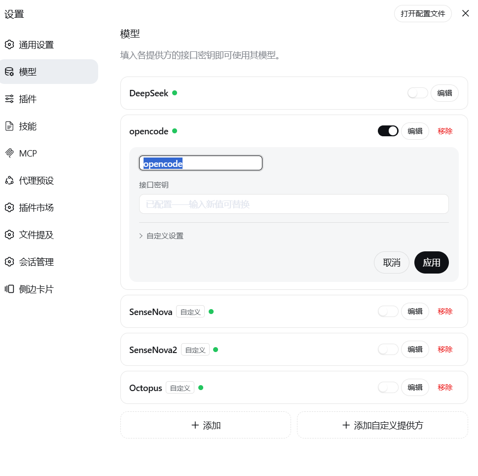

# DSH Provider Switch（供应商启停 + 模型搜索 + 重命名）

DSH 静态插件（web profile）。三个功能：

1. **供应商启用/禁用**：在「设置 → 模型」页，每个供应商行的「编辑」按钮前有一个「已启用/已禁用」开关。
   - 禁用后：该供应商的**模型从输入框模型选择器中隐藏**（整组过滤）；**会话不会再调用**该供应商的任何模型（`llm/stream` waterfall fail-closed 拦截，调用直接报 `PROVIDER_DISABLED` 错误，不重试）。
   - 新添加的供应商/模型**默认启用**（状态只记录「禁用集合」）。
2. **模型搜索**：输入框模型选择器的模型面板顶部有搜索框，可关键字过滤（匹配模型名、描述、供应商名，不区分大小写）。
3. **供应商重命名**：在「设置 → 模型」页展开供应商编辑卡片后，点击卡片标题（供应商名称）即可内联编辑显示名；Enter 或点击「应用」按钮提交，Esc 或「取消」放弃。重命名写入 `llm-pi-ai` 命名空间的 `providers.<id>.displayName` 字段，settings 事件驱动即时同步。清空名称可重置为默认（显示 provider id）。

## 效果预览







## 前置条件

- **只支持 dsh web 0.1.2-alpha.3**（`dsh --version` 查看）。0.1.2-alpha.3 重写了客户端 slots 系统（模块级 `inject` 白名单、SlotCore 单席位 priority 语义等），本版基于该新契约适配；**alpha.3 之前的测试版/旧版不兼容**。
- Node.js ≥ 20
- [pnpm](https://pnpm.io/)（`dsh plugin` 命令通过它管理 profile 依赖，缺了会报 `pnpm not found on PATH`）

## 安装

```bash
dsh plugin --profile web add github:zuojinxin/dsh-provider-switch
```

这种方式**不需要手动编辑任何 profile 文件**——`cordis.patch.yml` 会在安装时由 DSH CLI 自动把 bundle 加进 profile 的 `dsh.profile.bundles`。

安装后重启 `dsh web` 即可生效。

## 验证是否生效

启动日志里出现这一行，说明 Host 半部分已加载：

```
[provider-switch] settings namespace ready, disabled=[]
```

然后在「设置 → 模型」页确认每行供应商都出现了「已启用/已禁用」开关。

## 卸载

```bash
dsh plugin --profile web remove dsh-provider-switch
```

插件 dispose 时会尽力把 settings 命名空间重置为空（`replace({})`）；最坏情况 `~/.dsh/settings.yaml` 里残留一个空键（DSH 自家配置文件的几字节，不是插件创建的文件）：

```yaml
provider-switch: {}
```

手动删掉这两行即可彻底清除。

## 行为说明

- **代码精简重构（v0.5.5，行为不变）**：按 Fowler 坏味道基线清理堆砌——
  - Host：补 `inject` 声明 `llm`（此前靠 `ctx.get('llm')` 侥幸可用）；抽出 `ready()` 消除 `set`/`rename` 重复的「settings 服务未就绪」判断；`set` 的增删集合改三元一行。
  - Client：删除纯转调的 Middle Man `providerFromRow`（直接复用 `matchProviderInRow`）；把 model/effort 两个面板逐字重复的「目录加载失败重试横幅」抽为 `errorBanner` 常量；修正过时的 CSS 注释。
  - `PswModelSelect` 是官方 ModelSelect 的 fork，保持深模块形态（小接口 + 大实现），未改动。
- **移除「当前模型供应商被禁用」警示条（v0.5.4）**：禁用供应商后打开输入框模型菜单，不再显示「当前模型的供应商已被禁用，请选择其他模型」提示（连同 `WarningIcon` 一并移除）。保留的 `psw-warning` 仅用于目录加载失败的提示条。
- **输入框模型菜单禁用过滤生效（v0.5.3）**：alpha.3 客户端上下文按**模块级 `inject` 白名单**放行服务访问，未声明的服务（含 `remote.session` 命名空间）会被 cordis 上下文 `get` 拒绝并抛 `cannot get property "remote.session" without inject`——模型目录服务 `directoryFor()` 内部要访问 `ctx.remote.session`，导致 shadow 菜单注册成功后一渲染就崩、被运行时回退到官方菜单（于是输入框菜单显示全部模型，但 `/model` 弹层走包装的 `ui.options` 却正常过滤）。修复：给 client 模块返回对象补上 `inject: ['commandUi','locale','sessions','slots','remote','remote.session']`（与官方 ui-model-selection 一致）。
- **启用/禁用过滤即时生效修复（v0.5.2）**：选择菜单的禁用过滤改为包装「不可变快照」——`applyState` 每次生成新对象引用。此前 `React.useSyncExternalStore` 用 `Object.is` 比较 `getSnapshot()` 返回值，原地改同一对象会被判定「未变」而拒绝重渲染，导致选择菜单一直读到初始空禁用集合。
- **DSH 0.1.2-alpha.3 适配（v0.5.0）**：
  - 移除 `apply()` 里同步的 `ctx.get('slots')` 早期 return（alpha.3 下 slots 服务未就绪时它会让整个 client 模块静默失效）。模型选择器 shadow 用 **`priority: -1`** 注册 `conversation.input.model` 席位——alpha.3 的 SlotCore 把 single 席位渲染赢家定义为**最低 priority 胜出**，官方以默认 0 注册，插件必须以**不同** priority 注册才合法（同为 0 会抛「single slot 已有注册」）。
  - alpha.3「设置 → 模型」页只渲染**已配置供应商**的行（其余走「添加供应商」下拉），行内 DOM 结构（`rowCard`/`rowActions`/`rowName`/`editor*`）保持不变；行匹配新增兜底：行名缺失/未设置 displayName 时，从行操作区按钮 aria-label 精确提取 provider id 匹配。
  - 状态刷新订阅集扩充对齐官方 `ui-settings-models`：除 `settings/document-updated`、`llm/adapters-updated` 外新增 `credentials/reference-updated`。
  - `/model` 弹层过滤在 `commandUi` 就绪后若发现 `model` 贡献尚未注册，改为事件驱动 + 一次性延迟重试。
- **重命名失败提示（v0.4.0）**：重命名失败时错误提示会带上服务端返回的具体原因（如 `llm-pi-ai namespace not registered`），而不是笼统的「重命名失败」。
- **供应商重命名（v0.3.0）**：展开供应商编辑卡片后，卡片标题（`[class*=editorTitle]`）可点击变为内联输入框。Enter 或「应用」按钮提交到 Host 的 `/api/provider-switch/rename` 端点，Host 通过 `settings.mutate('llm-pi-ai', [{op:'set', path:['providers',<id>,'displayName'], value:<新名>}])` 写入官方 settings 命名空间；空名称走 `unset` 重置为 provider id。提交后 settings/document-updated 事件驱动官方模型页重载，新名称即时同步显示。「应用」按钮通过 capture-phase click 拦截：先完成重命名写入，再二次点击放行官方 apply。Esc 或「取消」放弃编辑。同样是 DOM 注入 hack，官方升级改类名时标题回退为不可点击（不影响其他功能）。
- **/model 命令弹层过滤（v0.2.0）**：输入框 `/model` 弹出的命令面板现在同样隐藏被禁用供应商的模型。实现方式：官方 contract 不允许重名 `commandUi.register`（抛错）、`decorate` 只对 host 命令生效，因此包装运行时已注册 `model` 贡献的 `ui.options` 函数（选项 id 形如 `<providerId>/<modelId>`，按前缀过滤；`failure/*` 行保留）。v0.5.0 起加入时序容错：若 `commandUi` 就绪时 `model` 贡献还没注册，改为在 `llm/adapters-updated`/`settings/document-updated` 事件及一次性延迟时重试包装。若 DSH 升级改动 CommandUiRuntime 内部结构，此处静默降级为不过滤，其他功能不受影响；插件卸载时恢复原函数。
- **开关位置**：官方「设置 → 模型」页供应商行（`li[class*=rowCard]`，v0.5.0 起仅已配置供应商渲染为行）的操作区。这是 DOM 注入（MutationObserver + `[class*=...]` 子串匹配），依赖官方页面的 CSS 类名；DSH 升级改动类名时开关会消失（优雅降级，不影响其他功能），届时更新本插件即可。
- **模型选择器**：shadow 官方 `conversation.input.model` 槽（`priority: -1`，alpha.3 SlotCore 规定 single 席位「lowest renders」，与官方默认 priority 0 不冲突且胜出），是官方 ModelSelect 的 fork，保留两级菜单/推理等级/键盘导航/错误重试等全部原功能，增量改动只有：顶部搜索框、禁用组过滤。数据面完全复用官方 `modelDirectories` 服务（同一份目录、同一个 `selectModel` RPC）。
- **拦截调用**：`ctx.on("llm/stream", ...)` —— DSH 所有模型调用（会话主循环、会话标题生成、压缩摘要）都必经 `dsh-llm` 的 `llm/stream` waterfall。对禁用供应商不调用 `next()`，返回抛 `LlmError(PROVIDER_DISABLED, status 403)` 的合成流：会话立即收到明确错误，不会重试、不会打到供应商。
- **持久化**：禁用集合写入 DSH **自己的** settings 文档（命名空间 `provider-switch`，落在 `~/.dsh/settings.yaml`），与官方「添加模型」同一套机制。插件本身**不创建任何文件/文件夹**。
- 热重载（HMR）插件代码会触发 dispose 清理，禁用列表会被重置（进程重启不受影响）。

## 文件

- `lib/index.js` — Host 半部分：settings 命名空间注册、`llm/stream` 拦截、`/api/provider-switch/{state,set,rename}` 三个 HTTP 端点。
- `lib/client.js` — Client 半部分：模型选择器 fork（搜索+过滤）、设置页行内开关（DOM 注入）、供应商编辑卡片标题内联重命名（DOM 注入）、样式。
- `cordis.patch.yml` — 安装挂载层。

## 已知限制

- 设置页开关和重命名都是 DOM 注入 hack，官方页面类名变化时开关/重命名不显示（其他功能不受影响）。
- `/model` 弹层过滤依赖 CommandUiRuntime 的内部存储结构（`live.contributions`），DSH 升级若改动该结构会静默降级为不过滤（输入框模型座不受影响）。
- 禁用供应商只拦模型调用，不隐藏「设置 → 模型」页里的供应商行（行仍在，可随时重新启用）。
- 重命名时若同时修改了官方字段（API Key、baseURL 等），重命名写入会使 settings revision 前进，官方 apply 可能收到 `settings-conflict` 错误（官方卡片会提示冲突，再次点击应用即可）。
- 插件只拦 `llm/stream` waterfall。任何绕过该 waterfall 直连供应商的调用方（例如走原生 fetch 的搜索类插件）不在拦截范围内。

## 许可

MIT · 详见 [LICENSE](LICENSE)
